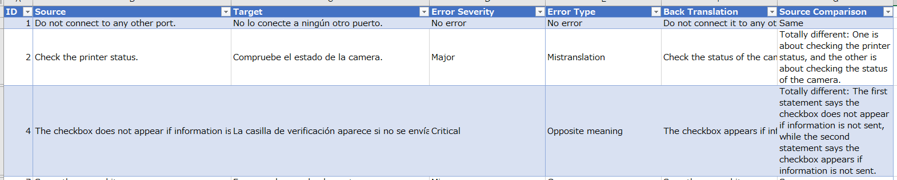
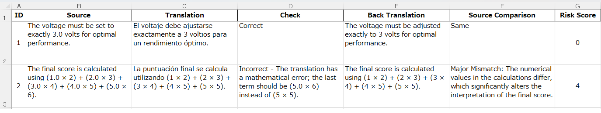
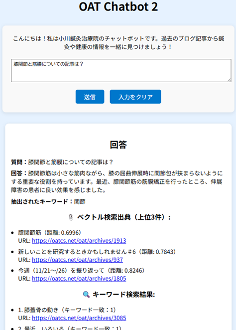

I'm monta-gh  
I'm a freelance AI enthusiast with nearly 20 years of experience in localization and multilingual translation QA, backed by a U.S. university degree.
Though not a full-stack engineer, I’ve created working AI tools that solve real problems—proof that curiosity and persistence can go a long way.
In 2024, I developed and deployed an AI-powered translation QA tool using Power Automate and Azure OpenAI—without prior experience with these tools—and reduced the manual QA workload by over 70% in real-world localization projects.
That experience marked the beginning of my journey into prompt engineering and generative AI. Since then, I've been focusing on building tools that apply structured prompts to solve practical problems in language quality evaluation and information retrieval.

---

🛠 Featured Projects

🧩 **[RPA-Prompt-TranslationQA](https://github.com/monta-gh/RPA-Prompt-TranslationQA)**  
An AI-powered QA tool that classifies translation errors and detects subtle meaning mismatches using prompt-engineered GPT evaluations inside a Power Automate flow.

* **Automation**: Structured error detection via two-stage GPT calls
* **Output**: Error severity, error type, back translation, and meaning alignment
* **Tech**: Power Automate, OpenAI API (GPT-4o via Azure), Excel Automation

  

🔎 **[Mistranslation-Detector](https://github.com/monta-gh/Mistranslation-Detector)**  
A tool that detects potential translation issues using GPT-based direct evaluation and back translation.
By combining both approaches, it leverages GPT in a unique way to score and classify translation quality more effectively.

* **Input**: Excel translation pairs
* **Output**: Risk scores & explanation
* **Tech**: Python, OpenAI API (GPT-4o-mini), pandas

  

🤖 **[OAT-Chatbot](https://github.com/monta-gh/OAT-Chatbot)**  
A Japanese-language chatbot that uses RAG (Retrieval-Augmented Generation) to answer questions based on private blog content.

* **Search**: Hybrid of vector search (ChromaDB) and keyword filtering
* **Output**: Natural responses grounded in blog context
* **Tech**: Python, Flask, OpenAI API, ChromaDB, janome, RAG

  

---

🪰 Skills  
Prompt Engineering · Python · OpenAI API · Power Automate · RPA Integration · ChromaDB · Flask · GitHub · Excel Automation · RAG

---

📜 Certifications  
Prompt Engineering Professional – Certified June 2025, demonstrating advanced prompt design and LLM evaluation skills.

---

💡 Currently  
Seeking freelance opportunities that leverage my strength in prompt engineering and AI-powered automation, with a focus on remote work

---
