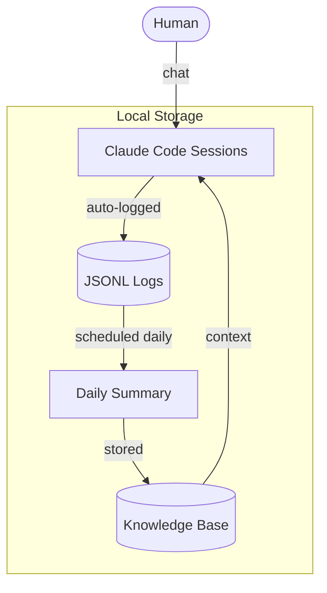

# AI Chat Memory Architecture (ACMA)

A **local-first memory architecture** that turns daily AI conversations into a compounding asset — built on Claude Code, designed by a non-engineer.

> **You don't just use memory — you design it.**

"Chat is dead," they say. But a better chat can be built on top of an AI agent. ACMA does exactly that. No subagents, no MCP — just a skill, a script, a scheduled task, and a Knowledge Base. Every conversation is logged locally, summarized automatically each morning, and carried forward into the next session — so the AI never forgets where the conversation left off.

---

## How It Works

Four parts form a loop. A user chats with Claude Code as normal. Every session is logged to a local JSONL file with no effort. A scheduled task runs each morning, reads yesterday's logs, and produces a daily summary based on a user-defined prompt. The summary lands in the Knowledge Base, and the next session reads it as context. **The loop closes — and every day adds to the memory.**

---

## The 4 Steps

### Step 1 — Skills: Adding Chat to Claude Code
Claude Code is built as an AI agent — strong at executing tasks. ACMA adds a chat experience on top of it, using a single skill file.

- For example, a custom skill named `chat-mode` triggers on phrases like "good morning" and switches Claude Code into a conversational mode
- The skill can be designed to read the latest daily summary at the start of every session
- The Knowledge folder is placed under the Claude Code root so the skill can reference it easily
- No CLAUDE.md changes, no complex setup — even a single skill file is enough
- The behavior is fully customizable — for example, the skill can stay quiet about work topics until brought up

**Why it matters:** Claude Code's execution power needs to be softened for chat. The skill does that — and it also marks the start of the ACMA loop, where each new session begins with yesterday's context already loaded.

---

### Step 2 — Auto-Logging: JSONL by Default
Every session with Claude Code is automatically saved as a JSONL file on the local machine — no action required.

- Fully automatic — no command, no setting to enable
- Stored locally — data never leaves the local machine
- Complete — the entire conversation is captured

**Why it matters:** Conversations turn into an asset without conscious effort. This is the raw material that powers the entire ACMA loop. Noticing this local auto-save was the moment ACMA was born — and it's the reason ACMA exists at all.

---

### Step 3 — Daily Summary: From Record to Memory
A scheduled task runs every morning, powered by two small files set up once: an extraction script and a summary prompt. Together they read yesterday's JSONL logs and produce a clean Markdown summary in the Knowledge Base.

- The extraction script (a small Python file) pulls yesterday's conversations from the JSONL logs
- The prompt file (e.g. `daily_summary_prompt.md`) defines the structure and focus of the summary
- The result is saved as a Markdown file (e.g. `daily_YYYY-MM-DD.md`) in the Knowledge Base
- Re-running on the same date overwrites the file — safe to run anytime

**Why it matters:** This is the step that turns "record" into "memory." And the prompt file is where ACMA becomes personal. **Choosing what to remember is choosing what to design.** Two people running ACMA with different prompts will build two completely different memory systems.

---

### Step 4 — Knowledge Base: The Loop Closes
Daily summaries accumulate in the Knowledge Base as plain Markdown files. The next session's `chat-mode` skill reads them and brings the context back into the conversation.

- All data lives as local Markdown files — readable, editable, portable
- The next session starts already knowing what happened yesterday
- The longer ACMA runs, the deeper the memory grows

**Why it matters:** Memory compounds. Each day adds to the base, and the next session inherits everything that came before. Nothing is a black box — any file can be opened, read, edited, or deleted. **Your memory stays yours.**

---

## How ACMA Compares to Chat AI

| Feature | Chat AI (ChatGPT / Claude.ai) | ACMA |
|---------|-------------------------------|------|
| Automation | Manual — no automatic processing | Fully automated — daily summary generated every morning |
| Memory Persistence | Project/Memory features available, but not reliable across sessions | Reliable and persistent — auto-accumulated daily |
| Parallel Multi-Session | Single session only | Multiple sessions can run simultaneously |
| Privacy | Data stored on external servers | All data stored locally — your memory stays yours |
| Transparency | Memory process is a black box | Fully transparent — all data stored as local Markdown files |
| Customizability | Limited — no control over what or how memory is stored | Fully customizable — define your own memory format via a prompt file |
| Context Window Visibility | Not visible | Visible (desktop app only) — users can decide when to start a new session |
| Mobile Access | Available on any device | Desktop only — remote control is still in preview and not yet stable |

*The current limitation is mobile access: Claude Code's remote control feature is still in preview and not yet stable. Full mobile support should be coming — and when it does, ACMA goes everywhere.*

---

## Use Cases

> **ACMA captures the journey. External files capture the decisions. Together, they form complete memory.**

### Case 1 — Complete Memory System
ACMA records the daily flow of conversations automatically. Pair it with separate Markdown files for long-term memory — decisions, insights, project notes — and the two work together as a complete memory system. ACMA and external files have a complementary relationship: ACMA holds the journey, external files hold the structure. Neither alone is enough. Together, they cover both.

### Case 2 — Multi-Scale Memory
ACMA starts with daily summaries — but the same logic extends further. Weekly, monthly, and quarterly summaries can be layered on top, producing a memory system that scales with time. The architecture is simple enough that anyone can extend it in the direction they care about most.

