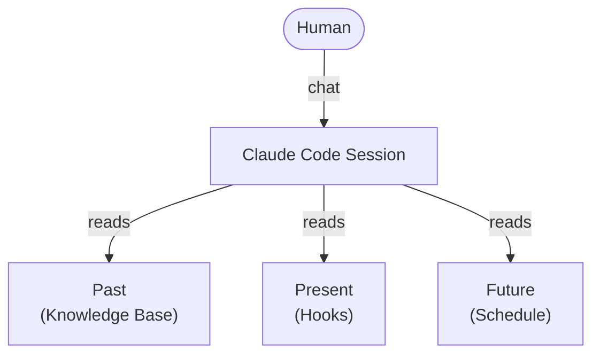
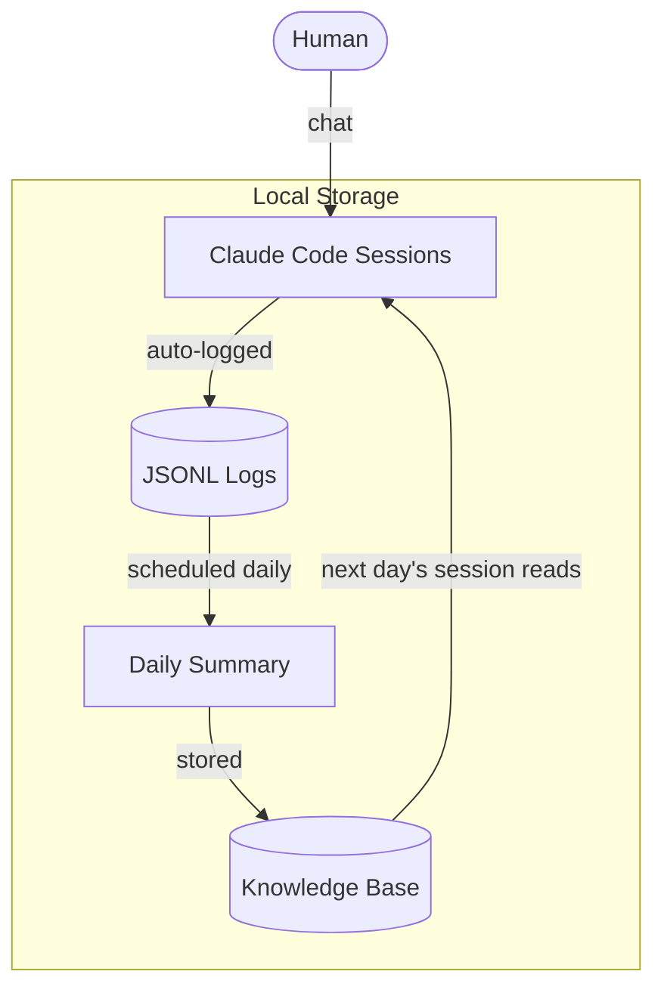

# AI Chat Memory Architecture (ACMA)

A **local-first memory architecture** that gives AI both time and memory — built on Claude Code, designed by a non-engineer.

> **Give AI time and memory. You design what it remembers.**

"Chat is dead," they say. But a better chat can be built on top of an AI agent. ACMA does exactly that. Every conversation is logged locally and summarized automatically — whenever you choose, in whatever format you design — then carried forward into the next session, now aware of not just what happened, but what's coming next.

---

## How It Works

### The Three Axes

ACMA is built on three axes — past, present, and future. The Knowledge Base carries what happened before. Hooks inject the current moment. A schedule — a calendar app via MCP, or even a plain Markdown file with dated plans — brings in what's ahead. Claude Code reads all three at the start of every session, so a conversation never starts blank — it already knows where it's been, what time it is, and what's coming.

### The Memory Loop

Four parts form a loop. A user chats with Claude Code as normal. Every session is logged to a local JSONL file with no effort. A scheduled task runs on a schedule the user chooses, reads yesterday's logs, and produces a daily summary based on a user-defined prompt. The summary lands in the Knowledge Base, and the next day's session reads it as context. **The loop closes — and every day adds to the memory.**

---

## The 5 Steps

### Step 1 — Skills: Adding Chat to Claude Code
Claude Code is built as an AI agent — strong at executing tasks. ACMA adds a chat experience on top of it, using a single skill file.

- For example, a custom skill named `chat-mode` triggers on phrases like "good morning" and switches Claude Code into a conversational mode
- The skill can be designed to read recent daily summaries at the start of every session
- The Knowledge folder is placed under the Claude Code root so the skill can reference it easily
- No CLAUDE.md changes, no complex setup — even a single skill file is enough
- The behavior is fully customizable — for example, the skill can stay quiet about work topics until brought up

**Why it matters:** Claude Code's execution power needs to be softened for chat. The skill does that — and it also marks the start of the ACMA loop, where each new session begins with yesterday's context already loaded.

---

### Step 2 — Auto-Logging: JSONL by Default
Every session with Claude Code is automatically saved as a JSONL file on the local machine — no action required.

- Fully automatic — no command, no setting to enable
- Stored locally — data never leaves the local machine
- Complete — the entire conversation is captured

**Why it matters:** Conversations turn into an asset without conscious effort. This is the raw material that powers the entire ACMA loop. Noticing this local auto-save was the moment ACMA was born — and it's the reason ACMA exists at all.

---

### Step 3 — Daily Summary: From Record to Memory
A scheduled task runs every morning, powered by two small files set up once: an extraction script and a summary prompt. Together they read yesterday's JSONL logs and produce a clean Markdown summary in the Knowledge Base.

- The extraction script (a small Python file) pulls yesterday's conversations from the JSONL logs
- The prompt file (e.g. `daily_summary_prompt.md`) defines the structure and focus of the summary
- The result is saved as a Markdown file (e.g. `daily_YYYY-MM-DD.md`) in the Knowledge Base
- Re-running on the same date overwrites the file — safe to run anytime

**Why it matters:** This is the step that turns "record" into "memory." And the prompt file is where ACMA becomes personal. **Choosing what to remember is choosing what to design.** Two people running ACMA with different prompts will build two completely different memory systems.

---

### Step 4 — Knowledge Base: The Loop Closes
Daily summaries accumulate in the Knowledge Base as plain Markdown files. The next session's `chat-mode` skill reads them and brings the context back into the conversation.

- All data lives as local Markdown files — readable, editable, portable
- The next session starts already knowing what happened yesterday
- The longer ACMA runs, the deeper the memory grows

**Why it matters:** Memory compounds. Each day adds to the base, and the next session inherits everything that came before. Nothing is a black box — any file can be opened, read, edited, or deleted. **Your memory stays yours.**

---

### Step 5 — Hooks & Schedule: Adding Present and Future
Steps 1–4 complete the memory loop — the past. Step 5 adds the other two axes: the present and the future.

- A hook runs at the start of every session and injects the current date, time, and day of the week — the AI always knows "when" it is
- A schedule brings in what's ahead — a calendar app connected via MCP, so the session can read today's plans and even create or update events
- A calendar app is not required — even a plain Markdown file with dated plans works
- Both are read automatically at session start, together with the daily summaries from Step 4

**Why it matters:** Memory alone looks backward. With the present and the future added, the AI doesn't just remember what happened — it knows what today is and what's coming next. This is where ACMA grows from a memory system into something closer to a companion.

---

## How ACMA Compares to Chat AI

| Feature | Chat AI (ChatGPT / Claude.ai) | ACMA |
|---------|-------------------------------|------|
| Memory Persistence | The AI decides what to remember and when to recall it — no guarantee it comes back | By design — every session starts by reading the memory files you choose |
| Customizability | Limited — no control over what or how memory is stored | Fully customizable — define your own memory format via a prompt file |
| Automation | Manual — no automatic processing | Fully automated — daily summary generated every morning |
| Time Awareness | Doesn't know what day it is or what's ahead | Knows the date, the time, and what's coming next — via hooks and schedule |
| Privacy | Data stored on external servers | All data stored locally — your memory stays yours |
| Transparency | Memory process is a black box | Fully transparent — all data stored as local Markdown files |
| Context Window Visibility | Not visible | Always visible at a glance (desktop app) — users can decide when to start a new session |
| Mobile Access | Available on any device | Desktop only — remote control is still in preview and not yet stable |

---

## Use Cases

> **Same architecture, entirely different memory.**

The daily summary prompt defines what gets remembered. Change the prompt, and the same system becomes a completely different memory — designed for a different person, a different life. Every conversation with AI sits somewhere between two ends — with a goal, and without one. ACMA serves the whole range, and most people live somewhere in between.

### With a goal — developers, freelancers, students, researchers
Someone who drives their own projects day after day. The memory prompt is designed for momentum — it captures progress, decisions, and open questions, so every session starts where the last one ended — already aware of today's date and what's on the schedule. This is the author's own setup, running daily.

### Without a goal — anyone who just wants someone to talk to
Not every conversation needs a goal. An older adult living alone, a parent home with young kids, someone who wants a partner to share feelings with — for them, the memory prompt focuses on feelings and daily life: how the day felt, small joys, and things to look forward to. The AI greets them each morning already knowing how yesterday went — and what they're looking forward to. A companion that remembers, day after day.

> **Wherever you are between them, the memory is yours to design.**

