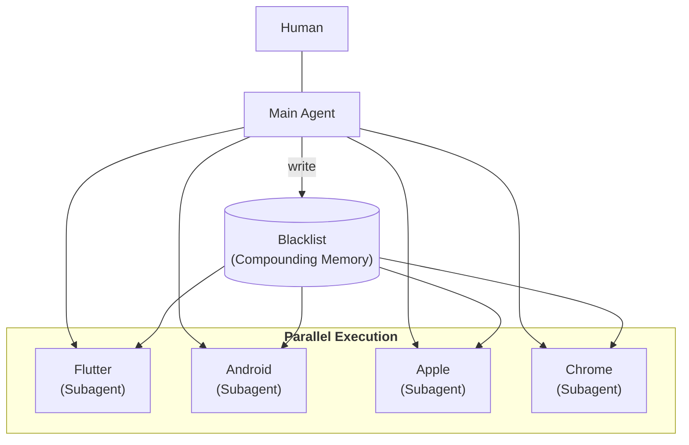

# OSS Search Workflow

A **parallel AI agent workflow** for discovering localization-ready OSS projects on GitHub — the upstream stage of the [localization workflow](workflow.md).

> **Four platform-specialized subagents run in parallel. One memory that compounds. Zero write conflicts.**

**Before any translation begins, the right project has to be found.** This workflow screens hundreds of GitHub repositories across four platforms — Flutter, Android, iOS/macOS, and Chrome Extensions — and narrows them down to projects where a Japanese localization PR is both technically possible and genuinely welcome. **Finding where not to contribute is half the work — and every run remembers it, so the next one screens faster and cheaper.**

---

## How It Works

Each platform has its own search query, i18n conventions, and screening pitfalls — so each gets a subagent that specializes in one. The subagents browse GitHub through Chrome MCP and run in parallel — the work splits into as many independent screening tasks as needed.

---

## The Workflow

### Step 1 — Parallel Subagent Execution
Before launch, the human operator confirms scope — which platforms, how many repositories, which result page to start from. The Main Agent then spins up the subagents, each of which:

- Opens a fresh browser tab and searches GitHub directly via Chrome MCP — no cached data, no stale results
- Works from a platform-specific search query (e.g. `android app stars:>100 language:Kotlin`)
- Writes its findings to its own dedicated result file

**Why it matters:** The screening tasks are independent, so running them in parallel is much faster than one at a time. The human confirms the scope before launch — a wrong assumption there would spread to every subagent at once. And during the run, no two subagents write to the same file: each has its own result file, and the shared Blacklist is read-only to them.

---

### Step 2 — Primary Screening (Fast & Cheap)
Each subagent scans the search result list and filters out obvious non-candidates without entering the repositories:

- Already recorded in the Blacklist
- Libraries, SDKs, frameworks, developer tools
- Sample / demo / template projects
- Apps outside the target audience — not aimed at general users, or unlikely to have Japanese demand

**Why it matters:** Most repositories can be skipped just by looking at the title, description, and star count. There's no need to open every one — that would only waste time and cost with nothing gained.

---

### Step 3 — Secondary Screening (Deep & Precise)
Repositories that survive primary screening get a full inspection. Each subagent checks, with platform-specific knowledge:

- **TMS usage** — projects on Weblate, Crowdin, Transifex, or Lokalise handle translations on their own platform, not through GitHub PRs. Detection is two-step: config files (`.weblate`, `crowdin.yml`, …) and a README keyword check, since some setups leave no config file behind
- **Existing Japanese files** — `values-ja/strings.xml` (Android), `ja.lproj` / `.xcstrings` with `ja` keys (Apple), `_locales/ja/messages.json` (Chrome), `ja.arb` (Flutter)
- **i18n readiness** — a project with no i18n structure at all cannot accept a translation file, no matter how good it is

**Why it matters:** Primary screening worked from the list alone. But whether a project uses a TMS, already has Japanese, or supports i18n at all — none of that shows on the surface. You have to open the repository and look. Some TMS setups don't even leave a config file behind, which is why the check also reads the README.

---

### Step 4 — Collect & Report
After all subagents complete, the Main Agent collects every result file and reports to the human:

- Promising candidates per platform, with reasons
- Skipped repositories, each with its individual reason

**Why it matters:** Subagents keep the Main Agent's context window slim during execution — the Main Agent never sees a single GitHub page. It steps back in only where judgment is needed, handing the human a clear summary to decide on.

---

### Step 5 — Blacklist Update (Main Agent Only)
After all subagents complete, the Main Agent — and only the Main Agent — adds the newly rejected repositories to the Blacklist, skipping any that are already listed.

- Each entry records the repository, a one-line reason, and the date
- Only secondary-screening rejections are recorded

**Why it matters:** The Blacklist carries over to every future run. Each update means the next search skips what's already been checked — so over time, the screening gets faster and cheaper.

---

## How This Differs from the Localization Workflow

The two workflows are built the same way — subagents do the heavy work, the human makes the decisions — but the problems differ, so the designs differ.

|                        | [Localization Workflow](workflow.md)       | OSS Search Workflow                        |
| ---------------------- | ------------------------------------------ | ------------------------------------------ |
| **Problem**            | One project, done deeply                   | Many candidates, screened broadly          |
| **Execution**          | Sequential                                 | Parallel                                   |
| **Shared memory**      | `session_context.md` — one per project     | Blacklist — persists and compounds         |
| **Write access**       | Each subagent writes its own analysis      | Main Agent only — no write conflicts       |
| **Human role**         | Approves every step, and reviews the translation | Confirms scope, reviews results       |
| **AI role**            | Analysis, translation, review, and Git operations | Search and screen with Chrome MCP      |
