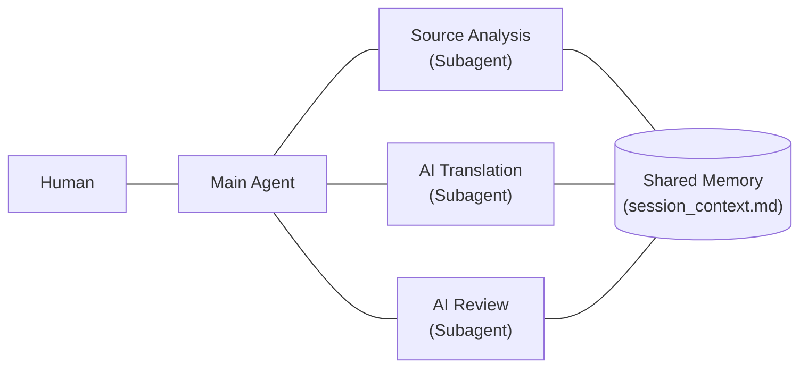

# Localization Workflow

A **human-guided AI agent workflow** for Japanese app localization — backed by 18 years of localization QA experience at a global language services company.

> **Every step is human-guided. No next step begins without human approval.**

**AI agents do the heavy lifting. Every step is controlled and approved by a human.** The result: professional translation quality, predictable delivery, and PR-based handoff — all within your existing GitHub workflow. **Slowing down is a quality decision, not a limitation.**

---

## How It Works

This design emerged through practice. Each major task — source analysis, translation, and review — is handled by a dedicated subagent, keeping the main agent's context window slim and ready for repository-specific requirements. It's not about efficiency — it's about keeping the main agent ready to lead.

---

## The 7-Step Workflow

### Step 1 — Repository & Source Analysis
A Source Analysis subagent — responsible for both Steps 1 and 2 — begins by analyzing the repository as a whole.

- What does the app do? Who uses it?
- What tone and voice does the UI use?
- Are there platform-specific conventions to follow? (macOS, Android, Web, etc.)
- What are the technical constraints of the i18n structure?
- Where are the translation files? (`_locales`, `i18n`, `locales`, etc.)
- What i18n config files are involved? (`manifest.json`, `package.json`, etc.)
- What languages are already translated?

**Why it matters:** TMS-based translators work string by string — they never see the whole product. This step is different: the AI agent reads the entire repository first, building a complete picture of the app's purpose, tone, and conventions. That context shapes every translation decision that follows.

---

### Step 2 — Pre-Translation Analysis
The same subagent then shifts focus to translation quality.

- Identify all translatable strings and their context
- Build a unified terminology table (key UI terms, brand names, untranslatable items)
- Flag technical edge cases: placeholders and escape sequences
- Define translation guidelines specific to this project
- Identify non-translatable fields (developer notes, etc.)
- Identify untranslatable proper nouns, product names, service names, and URLs
- Calculate word count of all translatable strings

**Why it matters:** This is where TMS-based workflows fall short — they hand files to a translator and assume the translator figures it out. This workflow turns it into a documented, repeatable process.

---

### Step 3 — AI Translation
With Steps 1 and 2 complete, a dedicated subagent begins translation — fully informed by the analysis.

- Translation is guided by the terminology table from Step 2
- Context from Step 1 shapes tone, formality level, and phrasing choices
- This is not "paste JSON into ChatGPT." It's context-aware, analysis-driven translation.

---

### Step 4 — AI Review
A separate AI agent — powered by a more capable model than the one used for translation, and with no access to the translation session — reviews the output independently.

- Checks for mistranslations, omissions, and inconsistencies
- Flags terminology violations against the unified table
- Verifies placeholder and escape sequence preservation
- Checks for UI length and layout impact
- Evaluates naturalness of Japanese expression
- Verifies proper nouns and URLs are untouched
- Produces a structured review report with line-level feedback

**Why it matters:** The same agent that translates cannot objectively review its own output — it tends to overlook its own mistakes, just as a human translator shouldn't proofread their own work. Independence is built into the process. Using a stronger model for review adds a second layer of rigor — catching subtle issues the translation agent may have missed.

---

### Step 5 — Native Human Review
The full translation is reviewed by a native Japanese speaker with 18 years of localization QA experience.

- Catches what AI misses: nuance, cultural fit, unnatural phrasing
- Cross-references the AI review report
- Makes final judgment calls on ambiguous cases

**Why it matters:** AI review reduces the human review burden — but it doesn't replace it. This step cannot be skipped. The human layer is where quality is guaranteed, not assumed.

---

### Step 6 — PR-Based Delivery
The final output is delivered as a GitHub Pull Request — not a file attachment, not a TMS export.

- Fork → branch → translate → PR: the same flow any contributor would use
- CI checks are monitored; if errors occur, they are diagnosed and fixed
- You review and merge on your own timeline, with full control

**Why it matters:** You never leave your own workflow. No external platform to manage. No file import process. Just a PR — ready to review and merge.

---
### Step 7 — Retrospective & Workflow Improvement
Every project ends with a structured retrospective — before the workflow is considered complete.

- What went smoothly? What caused friction?
- Were there translation decisions that required extra judgment?
- Did any step reveal a gap in the current process?

Findings are immediately reflected in the workflow instruction files and skill definitions.

**Every project makes the next one better. That's not a side effect. It's the last step.**

---

## How This Compares to TMS

**TMS platforms are built around translators.** They assume a human translator sits at the center, and the platform helps that translator work efficiently.

**This workflow is built around AI agents — controlled by a human.** AI handles translation and initial review. Human oversight covers analysis, review, judgment, and approval at every step.

|                                      | Community TMS (Weblate, etc.) | Commercial TMS (Trados, etc.) | This Workflow              |
| ------------------------------------ | ----------------------------- | ----------------------------- | -------------------------- |
| **Who translates**                   | Volunteers                    | Professional translators      | AI agents                  |
| **Pre-translation analysis**         | None                          | Built into the project setup  | Dedicated (Steps 1–2)   |
| **AI translation**                   | Optional                      | Add-on (post-edit model)      | Core of the process        |
| **Review layer**                     | Community                     | Human proofreader             | AI subagent + native human |
| **Human oversight**                  | Minimal                       | Varies                        | Every step, explicitly     |
| **Delivery format**                  | Direct commit / auto-merge    | File export                   | GitHub Pull Request        |
| **CI monitoring**                    | Not included                  | Not included                  | Monitored & fixed if needed |
| **Completion timeline**              | Unpredictable                 | Depends on resourcing         | Predictable                |
| **Cost structure**                   | Free but unreliable           | High (translator fees + TMS)  | Transparent pricing        |
| **Retrospective & self-improvement** | None                          | Not systematic                | Built into every project   |

---

## Supported Platforms

Any app that follows i18n conventions:

- **Web Apps** — JSON, JS, and similar formats
- **Chrome Extensions** — `_locales/` structure
- **Android** — `values-*/strings.xml`
- **Flutter** — ARB or JSON locale files
- **macOS / iOS** — `.lproj/Localizable.strings`, `.xcstrings`
---

## OSS Contributions

All contributions below were produced using this workflow and merged by the respective project maintainers.

→ [github.com/monta-gh](https://github.com/monta-gh)
